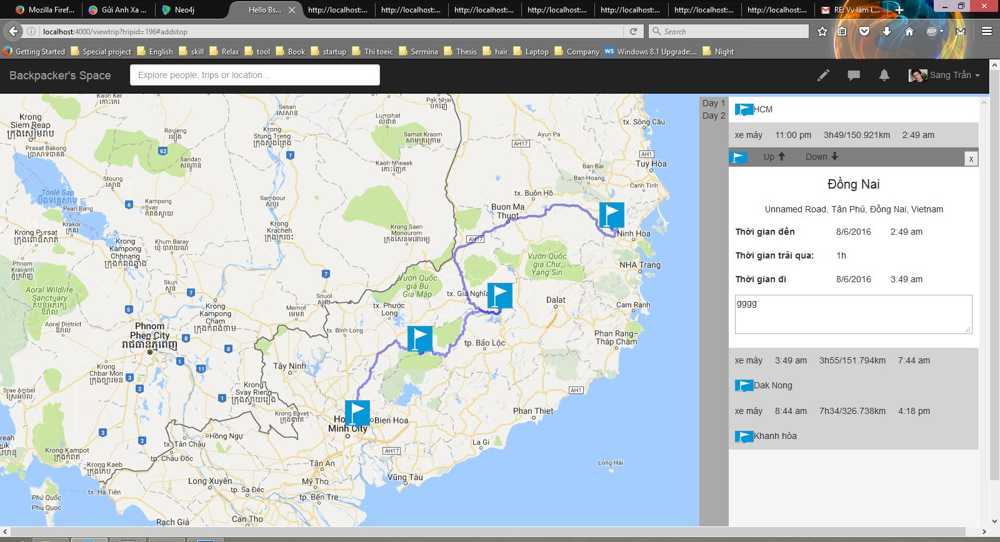

# Codename: BsnWeb
A web page for backpacker organize trips, find trips, find friends, add member to their trips and more functions.

## Add stop demo

To start your Phoenix app:

  * Install dependencies with `mix deps.get`
  * Create and migrate your database with `mix ecto.create && mix ecto.migrate`
  * Install Node.js dependencies with `npm install`
  * Start Phoenix endpoint with `mix phoenix.server`

Now you can visit [`localhost:4000`](http://localhost:4000) from your browser.

Ready to run in production? Please [check our deployment guides](http://www.phoenixframework.org/docs/deployment).\

## Url
  * [`localhost:4000\createtrip`]: to create a trip.
  * [`localhost:4000\viewtrip\195`]: to view a full trip in map (just view, should not edit).
  *	[`localhost:4000\viewtrip\196`]: view a part trip in map, can add more stops.

## Database
  * To view all nodes in database:
  	"MATCH (n)
	OPTIONAL MATCH (n)-[r]-(m)
	RETURN n,r,m"
  * To remove all stops of a trip: 
  	"MATCH (t:Trip)-[d:INCLUDE]->(s:Stop)-[l:LOCATE]->(i:Location), (s:Stop)-[th:THROUGH]->(r:Route)-[m:MODE]->(v:Vehicle)
	WHERE id(t)=196
	delete m,th,l,d,s,i,r"

## Learn more

  * Official website: http://www.phoenixframework.org/
  * Guides: http://phoenixframework.org/docs/overview
  * Docs: https://hexdocs.pm/phoenix
  * Mailing list: http://groups.google.com/group/phoenix-talk
  * Source: https://github.com/phoenixframework/phoenix
